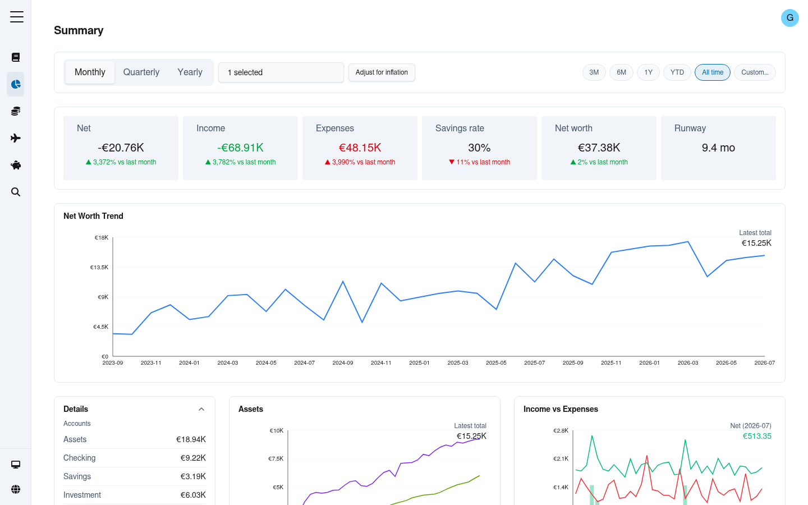

# GnuCash Insights

> A fast, self-hosted dashboard that turns a [GnuCash](https://www.gnucash.org/) book into
> clear, interactive charts — net worth, budgets, spending trends, trips, and transaction
> analysis, all in your browser.



**Live demo:** [victorvaquero.com/dashboard](https://victorvaquero.com/dashboard) — click
**Try as Guest** to explore with sample data, no sign-up required.

## Why

GnuCash is a great ledger but a poor dashboard. This app reads the data already sitting in
your GnuCash book and turns it into the kind of charts you'd expect from a modern budgeting
app: net worth over time, income vs. expenses, category breakdowns, budget-vs-actual,
recurring-charge detection, and a searchable/exportable transaction table — while your
ledger stays the source of truth.

## Features

- **Summary** — net worth trend, income vs. expenses, savings rate, runway, budget vs.
  actual, recurring expenses, top movers, all with month/quarter/year granularity and an
  inflation-adjustment toggle (real vs. nominal terms).
- **Expenses** — category breakdown with a tree view, this-year vs. all-years comparison,
  and a spending heatmap.
- **Trips** — per-trip and per-year travel spend, broken down by account and category.
- **Analysis** — a filterable, searchable transaction table with CSV export and ad-hoc chart
  selection.
- **Guest mode** — a public demo login backed by sample data, so anyone can try the app
  without connecting real financial data.
- **Light/dark theme**, **English/Spanish** localization, and a keyboard- and
  screen-reader-accessible UI (WCAG-conscious components, `axe` checks in CI).

## Tech stack

| Layer       | Choice                                                                                                                          |
| ----------- | ------------------------------------------------------------------------------------------------------------------------------- |
| Framework   | [React 19](https://react.dev/) + [Vite 7](https://vite.dev/)                                                                    |
| Routing     | [TanStack Router](https://tanstack.com/router) (file-based)                                                                     |
| Data        | [TanStack Query](https://tanstack.com/query) · [Drizzle ORM](https://orm.drizzle.team/) · [Turso](https://turso.tech/) (libSQL) |
| Styling     | [Tailwind CSS v4](https://tailwindcss.com/) + [Radix UI](https://www.radix-ui.com/) primitives                                  |
| Charts      | [Recharts](https://recharts.org/) + hand-rolled D3 charts                                                                       |
| Validation  | [Zod](https://zod.dev/)                                                                                                         |
| i18n        | [i18next](https://www.i18next.com/) (`en`, `es`)                                                                                |
| Testing     | [Vitest](https://vitest.dev/) + [Testing Library](https://testing-library.com/) + [Playwright](https://playwright.dev/)         |
| Docs/UI kit | [Storybook](https://storybook.js.org/)                                                                                          |

## Getting started

Requires Node.js ≥ 24 and [pnpm](https://pnpm.io/).

```bash
pnpm install
pnpm dev
```

The app runs against a Turso (libSQL) database — see `docs/architecture.md` for the data
layer, auth, and deployment setup required to run it against your own GnuCash data. There's
no built-in "drag and drop a GnuCash file" importer yet: ingestion (parsing a GnuCash export
into the database this app reads) is currently a separate, private pipeline.

Useful scripts:

```bash
pnpm test          # unit tests (Vitest)
pnpm test:e2e       # end-to-end tests (Playwright)
pnpm lint           # oxlint + eslint
pnpm storybook      # component explorer
pnpm seed-guest-data # populate local guest/demo data
```

## Project structure

```
src/
├── routes/       # file-based pages (summary, expenses, travels, analysis, ...)
├── components/   # shared UI (nav, charts, tables)
├── db/           # Drizzle schema + query builders
├── services/     # auth, DB connection
├── i18n/         # en/es translations
└── hooks/        # cross-cutting client state (theme, auth, persistence)
```

See [`docs/architecture.md`](docs/architecture.md) for the full architecture write-up.

## Deployment

Deploys via **Vercel**, connected to this GitHub repo — pushing to the default branch
triggers a production deploy automatically, and every branch/PR gets its own preview
deployment.

It's served at [victorvaquero.com/dashboard](https://victorvaquero.com/dashboard) as its
own independent Vercel project; the domain owner's repo proxies `/dashboard/*` to this
project's deployment (see `docs/architecture.md` for details). `vercel.json` sets the
security response headers (CSP, X-Frame-Options, X-Content-Type-Options,
Referrer-Policy) and the SPA fallback rewrite that lets client-side routes resolve on
direct load/refresh.

## License

[MIT](LICENSE)
